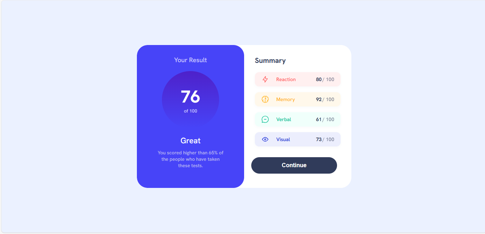

 ## Overview
This project is a solution to the  on Frontend Mentor. The goal was to build a results summary card that displays a user's score along with a breakdown of categories such as Reaction, Memory, Verbal, and Visual. This component focuses on clean layout, color usage, and responsive design.

## Features
- Fully responsive layout

- Accessible and semantic HTML structure

- Hover effects for interactive elements

- Flexbox layout for easy alignment

- Google Fonts integration (Hanken Grotesk)

- Visually styled score circle with category breakdown

- Smooth color transitions and gradients for a modern look

### Screenshot

## Live Demo
https://echo-script0.github.io/result-summary-component/

## Author
Aisha Adeyemo
- Frontend Mentor - (https://www.frontendmentor.io/profile/echo-script0)

